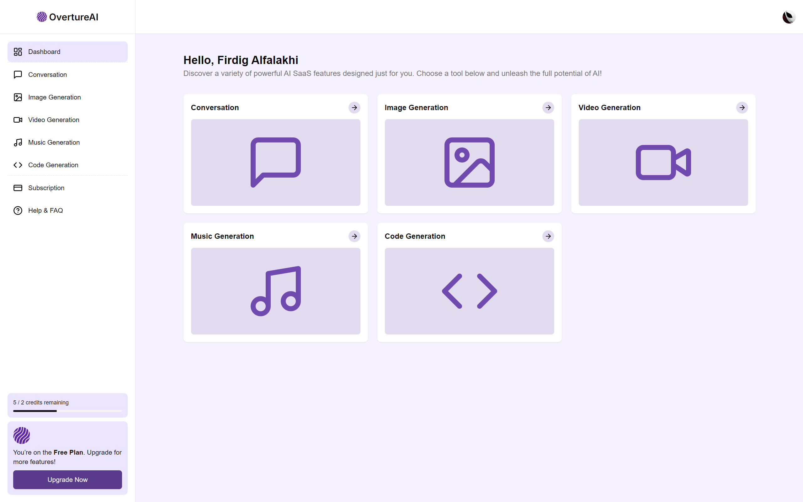

<div align="center">
  <p align="center"></p>
  <h1 style="border: none;">OvertureAI: A subscription-based SaaS platform powered by AI</h1>
  <div>
    
    
    
    
    
    
    
  </div>
</div>

## 📋 <a name="table">Table of Contents</a>

1. 🤖 [Introduction](#introduction)
2. ⚙️ [Tech Stack](#tech-stack)
3. 🔋 [Features](#features)
4. 🤸 [Quick Start](#quick-start)

## <a name="introduction">🤖 Introduction</a>

Discover OvertureAI: Your All-in-One AI Assistant – Revolutionize your digital experience with cutting-edge AI capabilities. Benefit from intelligent chat assistance, seamless code creation, innovative music generation, captivating video editing, and expert-level image design. Elevate your productivity and creativity with OvertureAI.
<br /><br />


## <a name="tech-stack">⚙️ Tech Stack</a>

- Next.js
- TypeScript
- PostgreSQL
- Clerk
- Supabase
- Midtrans
- Shadcn
- TailwindCSS
- Prisma
- Zod

## <a name="features">🔋 Features</a>

👉 **Advanced Tools and Functionalities**:

- Tailwind design with animations and effects for full responsiveness.
- Client form validation and handling using react-hook-form.
- Server error handling using react-toast.
- AI Tools for Image (Open AI), Video (Replicate AI), Conversation (Claude AI), Code Generation (Claude AI), and Music Generation (Replicate AI).
- Page loading state management.
- Midtrans payment integration.
- Free tier with API limiting.

👉 **Development Best Practices**:

- POST, DELETE, and GET route handling in app/api.
- Data fetching in server react components by directly accessing the database.
- Managing relations between Server and Child components.
- Reusing layouts effectively.
- Responsive UI/UX for a seamless experience across devices

and many more, including code architecture and reusability

## <a name="quick-start">🤸 Quick Start</a>

Follow these steps to set up the project locally on your machine.

**Prerequisites**

Make sure you have the following installed on your machine:

- [Git](https://git-scm.com/)
- [Node.js](https://nodejs.org/en)
- [npm](https://www.npmjs.com/) (Node Package Manager)

**Set Up Environment Variables**

Create a new file named `.env` in the root of your project and add the following content:

```env
#CLERK
NEXT_PUBLIC_CLERK_PUBLISHABLE_KEY=
CLERK_SECRET_KEY=
NEXT_PUBLIC_CLERK_SIGN_IN_URL=/sign-in
NEXT_PUBLIC_CLERK_SIGN_UP_URL=/sign-up
NEXT_PUBLIC_CLERK_SIGN_IN_FORCE_REDIRECT_URL=/dashboard
NEXT_PUBLIC_CLERK_SIGN_UP_FORCE_REDIRECT_URL=/dashboard

#AI
ANTHROPIC_API_KEY=
OPENAI_API_KEY=
REPLICATE_API_TOKEN=

#SUPABASE & PRISMA
SUPABASE_PASS=
DATABASE_URL=
DIRECT_URL=

#MIDTRANS
MIDTRANS_SERVER_KEY=
MIDTRANS_CLIENT_KEY=

#EMAILJS
NEXT_PUBLIC_EMAILJS_PUBLIC_KEY=
NEXT_PUBLIC_EMAILJS_SERVICE_ID=
NEXT_PUBLIC_EMAILJS_TEMPLATE_ID=
```

Replace the placeholder values with your actual respective account credentials.

**Setup Prisma**

Add PostgreSQL Database (I used Supabase)

```bash
npx prisma db push
```

**Running the Project**

```bash
npm run dev
```

Open [http://localhost:3000](http://localhost:3000) in your browser to view the project.

#
